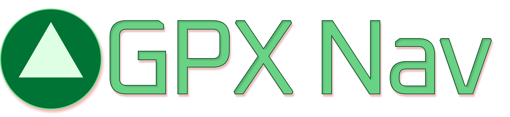

## Website: [nav.pelmers.com](https://nav.pelmers.com)

### Description

GPX Nav takes your GPX file and gives you the Google Maps directions URL, all in the browser.

> Note: there is some inaccuracy in the process. Google Maps only supports routes with up to 25 waypoints.

> Typical GPX track recordings take a point every second, so they end up with hundreds or thousands of track points.
Even when you export routes from apps like Strava or Garmin, you get a track file with many points, not a GPX route file with only turns labeled.

> I take a best-effort approach to give something reasonable by picking out 25 evenly-spaced points along your route.
But this will not be perfect. *Double-check the output!*

### New Features

**0.0.1**

-   First release
